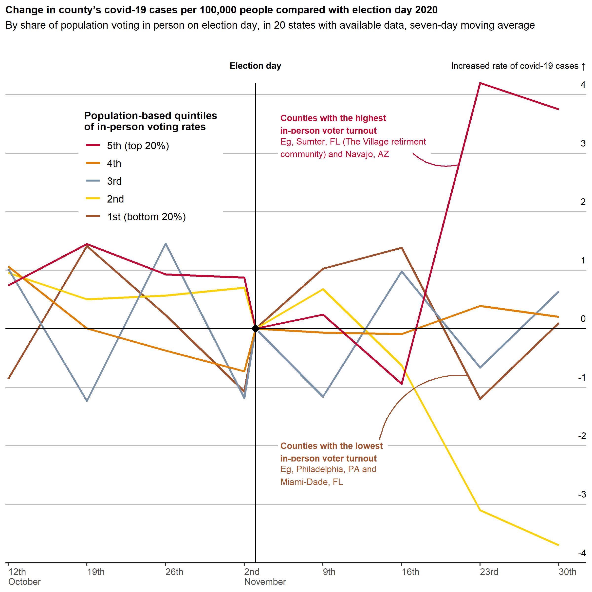

<!-- README.md is generated from README.Rmd. Please edit that file -->

```{r, include = FALSE}
knitr::opts_chunk$set(
  collapse = TRUE,
  comment = "#>"
)
```

# economist

This repository serves as place to store my attempts to recreate Economist Graphic Detail visualisations.

My interest in trying to recreate these graphics is to improve my skills in:

* creating fake data for use in mocking-up plots; and
* working with niche aspects of the `ggplot2` framework.

Each folder is named using the data the visualisation was released.

<br>

<style>
table th:first-of-type {
    width: 40%;
}
table th:nth-of-type(2) {
    width: 40%;
}
</style>

### 2021-07-10

Real            |  Attempt
:-------------------------:|:-------------------------:
  |  


<hr>
### 2020-11-21

Real            |  Attempt
:-------------------------:|:-------------------------:
 | 
