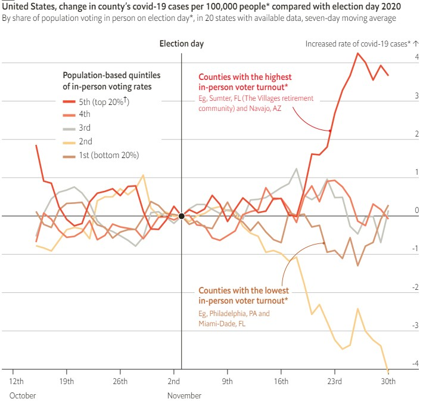
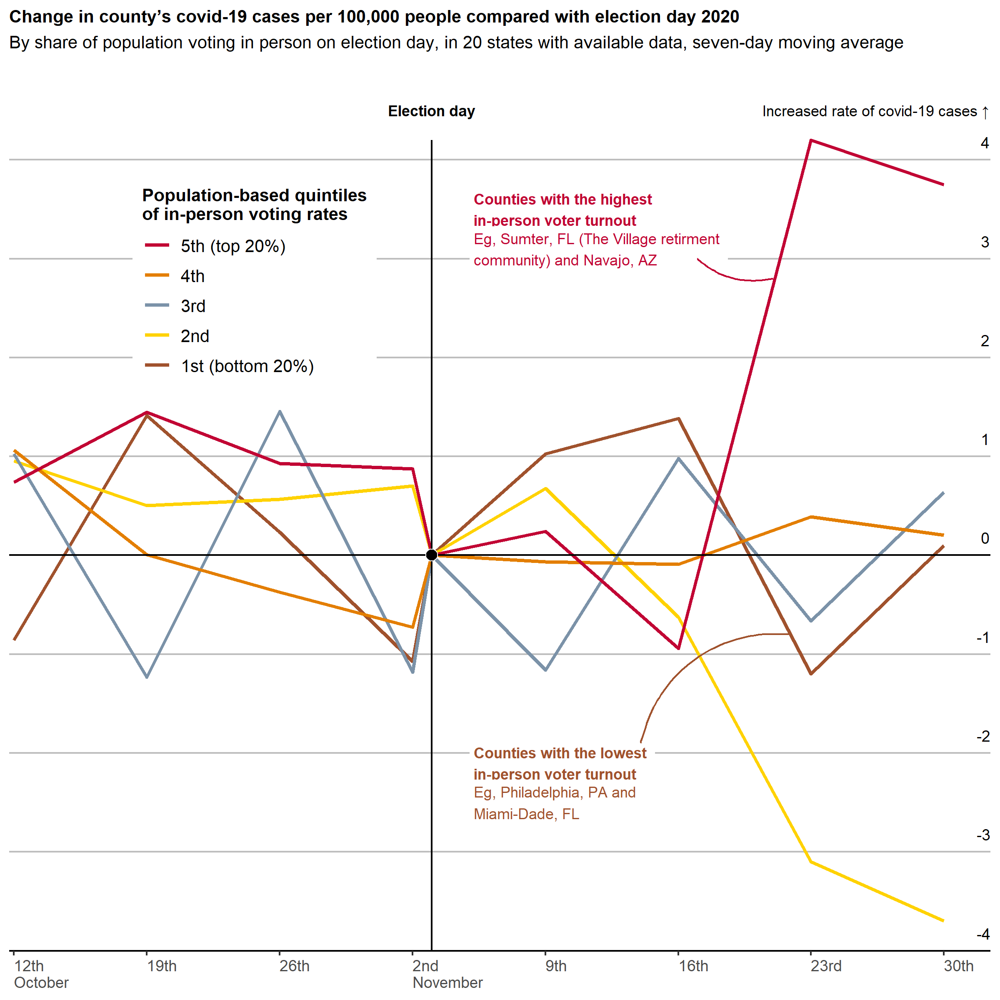

<!-- README.md is generated from README.Rmd. Please edit that file -->

# economist

This repository serves as place to store my attempts to recreate
Economist Graphic Detail visualisations.

My interest in trying to recreate these graphics is to improve my skills
in:

-   creating fake data for use in mocking-up plots; and
-   working with niche aspects of the `ggplot2` framework.

Each folder is named using the date the visualisation was released, and
contains the original graphic, plus code and the resulting image for my
attempt to recreate it.

 

## Examples

Some examples are shown below. In each case, the original graphic is on
the left, and the recreation attempt is on the right.

### 2021-07-10

</img>
</img>

### 2020-11-21

</img>
</img>

